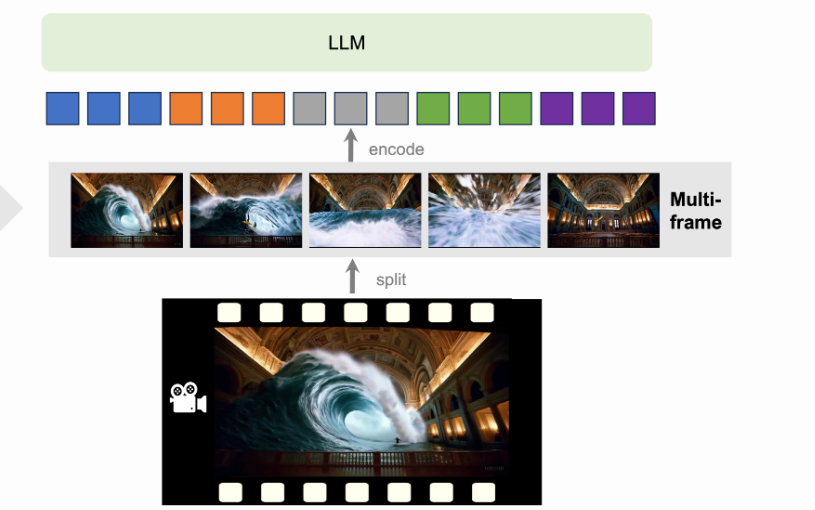

---
language:
- en
license: llama2
pipeline_tag: video-text-to-text
datasets:
- lmms-lab/VideoChatGPT
---

# LLaVA-NeXT-Video Model Card

Check out also the Google Colab demo to run Llava on a free-tier Google Colab instance: [](https://colab.research.google.com/drive/1CZggLHrjxMReG-FNOmqSOdi4z7NPq6SO?usp=sharing)

Disclaimer: The team releasing LLaVa-NeXT-Video did not write a model card for this model so this model card has been written by the Hugging Face team.

## 📄 Model details

**Model type:**
LLaVA-Next-Video is an open-source chatbot trained by fine-tuning LLM on multimodal instruction-following data. The model is buit on top of LLaVa-NeXT by tuning on a mix of video and image data to achieve better video understanding capabilities. The videos were sampled uniformly to be 32 frames per clip.
The model is a current SOTA among open-source models on [VideoMME bench](https://arxiv.org/abs/2405.21075).
Base LLM: [lmsys/vicuna-7b-v1.5](https://huggingface.co/lmsys/vicuna-13b-v1.5)




**Model date:**
LLaVA-Next-Video-7B was trained in April 2024.

**Paper or resources for more information:** https://github.com/LLaVA-VL/LLaVA-NeXT


## 📚 Training dataset

### Image
- 558K filtered image-text pairs from LAION/CC/SBU, captioned by BLIP.
- 158K GPT-generated multimodal instruction-following data.
- 500K academic-task-oriented VQA data mixture.
- 50K GPT-4V data mixture.
- 40K ShareGPT data.

### Video
- 100K VideoChatGPT-Instruct.

## 📊 Evaluation dataset
A collection of 4 benchmarks, including 3 academic VQA benchmarks and 1 captioning benchmark.


## 🚀 How to use the model

First, make sure to have `transformers >= 4.42.0`. 
The model supports multi-visual and multi-prompt generation. Meaning that you can pass multiple images/videos in your prompt. Make sure also to follow the correct prompt template (`USER: xxx\nASSISTANT:`) and add the token `<image>` or `<video>` to the location where you want to query images/videos:

Below is an example script to run generation in `float16` precision on a GPU device:

```python
import av
import torch
import numpy as np
from huggingface_hub import hf_hub_download
from transformers import LlavaNextVideoProcessor, LlavaNextVideoForConditionalGeneration

model_id = "llava-hf/LLaVA-NeXT-Video-7B-hf"

model = LlavaNextVideoForConditionalGeneration.from_pretrained(
    model_id, 
    torch_dtype=torch.float16, 
    low_cpu_mem_usage=True, 
).to(0)

processor = LlavaNextVideoProcessor.from_pretrained(model_id)

def read_video_pyav(container, indices):
    '''
    Decode the video with PyAV decoder.
    Args:
        container (`av.container.input.InputContainer`): PyAV container.
        indices (`List[int]`): List of frame indices to decode.
    Returns:
        result (np.ndarray): np array of decoded frames of shape (num_frames, height, width, 3).
    '''
    frames = []
    container.seek(0)
    start_index = indices[0]
    end_index = indices[-1]
    for i, frame in enumerate(container.decode(video=0)):
        if i > end_index:
            break
        if i >= start_index and i in indices:
            frames.append(frame)
    return np.stack([x.to_ndarray(format="rgb24") for x in frames])


# define a chat history and use `apply_chat_template` to get correctly formatted prompt
# Each value in "content" has to be a list of dicts with types ("text", "image", "video") 
conversation = [
    {

        "role": "user",
        "content": [
            {"type": "text", "text": "Why is this video funny?"},
            {"type": "video"},
            ],
    },
]

prompt = processor.apply_chat_template(conversation, add_generation_prompt=True)

video_path = hf_hub_download(repo_id="raushan-testing-hf/videos-test", filename="sample_demo_1.mp4", repo_type="dataset")
container = av.open(video_path)

# sample uniformly 8 frames from the video, can sample more for longer videos
total_frames = container.streams.video[0].frames
indices = np.arange(0, total_frames, total_frames / 8).astype(int)
clip = read_video_pyav(container, indices)
inputs_video = processor(text=prompt, videos=clip, padding=True, return_tensors="pt").to(model.device)

output = model.generate(**inputs_video, max_new_tokens=100, do_sample=False)
print(processor.decode(output[0][2:], skip_special_tokens=True))
```

-----------
From transformers>=v4.48, you can also pass image/video url or local path to the conversation history, and let the chat template handle the rest.
For video you also need to indicate how many `num_frames` to sample from video, otherwise the whole video will be loaded.
Chat template will load the image/video for you and return inputs in `torch.Tensor` which you can pass directly to `model.generate()`.

```python
messages = [
    {
        "role": "user",
        "content": [
            {"type": "image", "url": "https://www.ilankelman.org/stopsigns/australia.jpg"}
            {"type": "video", "path": "my_video.mp4"},
            {"type": "text", "text": "What is shown in this image and video?"},
        ],
    },
]

inputs = processor.apply_chat_template(messages, num_frames=8, add_generation_prompt=True, tokenize=True, return_dict=True, return_tensors"pt")
output = model.generate(**inputs, max_new_tokens=50)
```


### Inference with images as inputs

To generate from images use the below code after loading the model as shown above:

```python
import requests
from PIL import Image

conversation = [
    {
      "role": "user",
      "content": [
          {"type": "text", "text": "What are these?"},
          {"type": "image"},
        ],
    },
]
prompt = processor.apply_chat_template(conversation, add_generation_prompt=True)

image_file = "http://images.cocodataset.org/val2017/000000039769.jpg"
raw_image = Image.open(requests.get(image_file, stream=True).raw)
inputs_image = processor(text=prompt, images=raw_image, return_tensors='pt').to(0, torch.float16)

output = model.generate(**inputs_video, max_new_tokens=100, do_sample=False)
print(processor.decode(output[0][2:], skip_special_tokens=True))
```

### Inference with images and videos as inputs

To generate from images and videos in one generate use the below code after loading the model as shown above:

```python
conversation_1 = [
    {
      "role": "user",
      "content": [
          {"type": "text", "text": "What's the content of the image>"},
          {"type": "image"},
        ],
    }
]
conversation_2 = [
    {
      "role": "user",
      "content": [
          {"type": "text", "text": "Why is this video funny?"},
          {"type": "video"},
        ],
    },
]
prompt_1 = processor.apply_chat_template(conversation_1, add_generation_prompt=True)
prompt_2 = processor.apply_chat_template(conversation_2, add_generation_prompt=True)

s = processor(text=[prompt_1, prompt_2], images=image, videos=clip, padding=True, return_tensors="pt").to(model.device)

# Generate
generate_ids = model.generate(**inputs, max_new_tokens=100)
out = processor.batch_decode(generate_ids, skip_special_tokens=True, clean_up_tokenization_spaces=False)
print(out)
```

### Model optimization

#### 4-bit quantization through `bitsandbytes` library

First make sure to install `bitsandbytes`, `pip install bitsandbytes` and make sure to have access to a CUDA compatible GPU device. Simply change the snippet above with: 

```diff
model = LlavaNextVideoForConditionalGeneration.from_pretrained(
    model_id, 
    torch_dtype=torch.float16, 
    low_cpu_mem_usage=True,
+   load_in_4bit=True
)
```

#### Use Flash-Attention 2 to further speed-up generation

First make sure to install `flash-attn`. Refer to the [original repository of Flash Attention](https://github.com/Dao-AILab/flash-attention) regarding that package installation. Simply change the snippet above with: 

```diff
model = LlavaNextVideoForConditionalGeneration.from_pretrained(
    model_id, 
    torch_dtype=torch.float16, 
    low_cpu_mem_usage=True,
+   use_flash_attention_2=True
).to(0)
```


## 🔒 License
Llama 2 is licensed under the LLAMA 2 Community License, 
Copyright (c) Meta Platforms, Inc. All Rights Reserved.


## ✏️ Citation
If you find our paper and code useful in your research:

```BibTeX
@misc{zhang2024llavanextvideo,
  title={LLaVA-NeXT: A Strong Zero-shot Video Understanding Model},
  url={https://llava-vl.github.io/blog/2024-04-30-llava-next-video/},
  author={Zhang, Yuanhan and Li, Bo and Liu, haotian and Lee, Yong jae and Gui, Liangke and Fu, Di and Feng, Jiashi and Liu, Ziwei and Li, Chunyuan},
  month={April},
  year={2024}
}
```

```BibTeX
@misc{liu2024llavanext,
    title={LLaVA-NeXT: Improved reasoning, OCR, and world knowledge},
    url={https://llava-vl.github.io/blog/2024-01-30-llava-next/},
    author={Liu, Haotian and Li, Chunyuan and Li, Yuheng and Li, Bo and Zhang, Yuanhan and Shen, Sheng and Lee, Yong Jae},
    month={January},
    year={2024}
}
```